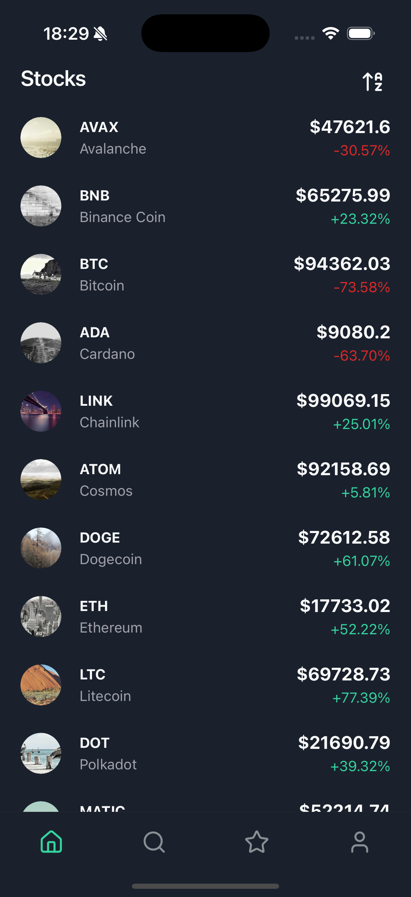

# Welcome to My Watchlist 📊

My Watchlist is a mobile application that allows users to track their favorite currencies and stocks.

## Preview



## Requirements

Before running this project, make sure you have the following tools installed:

- **Node.js** (recommended version: >= 18.x)
- **[pnpm](https://pnpm.io/installation)** (package manager)
- **[Expo CLI](https://docs.expo.dev/get-started/installation/)**
  - For Android: Follow the official Expo guide to set up an Android emulator: [Running on Android Emulator](https://docs.expo.dev/workflow/android-studio-emulator/)
  - For iOS (macOS only): Follow the Expo guide to set up an iOS simulator: [Running on iOS Simulator](https://docs.expo.dev/workflow/ios-simulator/)

## How to run the project

1. Install dependencies

   ```bash
   pnpm install
   ```

2. Start the app on Android

   ```bash
   pnpm android
   ```

3. Start the app on iOS (macOS only)

   ```bash
   pnpm ios
   ```

## Tech Stack

This project is built using the following technologies:

- **Expo**
- **Expo Router** (navigation/routing)
- **PNPM** (package manager)
- **RNR Reusables** (UI primitives)
- **NativeWind** (styling)
- **Victory-Native** (charts)
- **Zustand** (state management)
- **MMKV** (fast key-value storage)
- **Reanimated**

## Design Decisions

- **Expo Router** is used for navigation and file-based routing.
- **NativeWind** is used for faster development.
- **Zustand** is chosen for global state management due to its simplicity and performance.
- **MMKV** is used for fast, persistent local storage.

## Known Limitations

- Only supports English language UI.
- No authentication or user accounts.
- Data sources for currencies/stocks may have rate limits or delays.
- Currency charts only display the last year of historical data, with no option to change the date range.

## Upcoming Features

- [ ] Price alerts with push notifications
- [ ] Buy/sell functionality for cryptocurrencies
- [ ] Transaction history tracking
